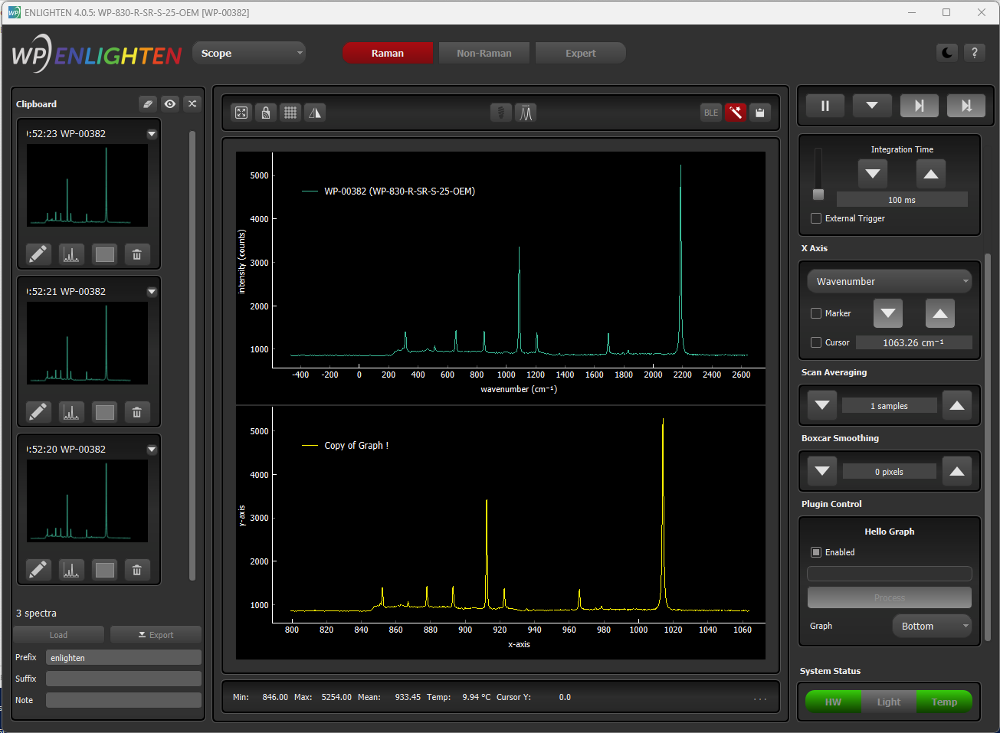

# Enlighten Plug-Ins

## Quick Start

A plugin is a single python file written by you that performs processing on spectra.

In Windows, plugins are stored in the Documents folder: `C:\Users\{you}\Documents\EnlightenSpectra`

Start by importing the essentials:

    from EnlightenPlugin import *

Your plugin script should contain one class extending `EnlightenPluginBase`. This class should be named after the filename of the plugin.

There are some methods to override.

- connect(self, enlighten_info)
- disconnect(self)

connect/disconnect are called when the Settings>Plugins>Connected checkbox is toggled. This is a good time to initialize or close any special resources associated with your plugin. It is not required to override these methods.

- get_configuration(self)

Before processing any live-spectra this function is called to inform Enlighten how to update the user interface for your plugin. 

You may want to create a few `EnlightenPluginField` instances, which will usually* populate the Scope>Plugin Control panel. These serve as interactive input/output fields.

*The exception is when datatype=pandas, then the output will be shown next to the graph.

- process_request(self, request)

This function will be called continuously when Scope>Plugin Control>Enabled is checked, or it will be called whenever the "Process" button is clicked.

`request` contains information about the spectra.

The pixel values (Y-axis) can be accessed via `request.processed_reading.get_processed()`. It is a one-dimensional list of numbers.

Information about the X-axis can be obtained via `request.settings.wavelengths` or `request.settings.wavenumbers`

## Displaying a graph (legacy)

To display a graph generated by your plugin you must first define the `series_names` in the `EnlightenPluginConfiguration` returned by your `get_configuration` function.

Then at the end of each `process_request` include `series =` within the returned `EnlightenPluginResponse`. It should be set to a dictionary with keys key matching series names and values either:
- a one-dimensional array of y-values, or
- a dict with 'y' and optional 'x' arrays



## Displaying a graph

Now to display a graph call the self.plot function from your process_request handler.

```
self.plot(
    title="My plot",
    color="green",
    x=my_x_coords,
    y=my_y_coords,
)
```

If you leave out the title, the plot will not appear in the legend.
This is useful when you are drawing something that has multiple parts, but you do not wish to clutter the legend.

If you leave out the color, a random one is selected.

Finally, omitting the x-values will generate a range that fits the y-values.

## Example

## Advanced use

# inline parameters
self.name
self.is_blocking
self.has_other_graph
self.table
self.x_axis_label
self.y_axis_label

# helper functions
getAxis
to_pixel
wavelength_to_pixel
wavenumber_to_pixel
area_under_curve

# api functions
field
get_widget_from_name
plot

## More Information

ENLIGHTEN's plug-in architecture is designed to allow end-users to write simple 
Python modules that can be dynamically loaded by ENLIGHTEN and run directly 
during spectral processing.  This allows users to manipulate spectra any way they
wish, including seeing their processed spectra appear on the graph alongside (or
instead of) ENLIGHTEN's own.

Python is a powerful data-processing language, and plug-ins are free to use 
popular mathematical libraries and frameworks, including Numpy, Pandas and SciPy.
In fact, Pandas dataframes may be output and displayed directly on the ENLIGHTEN
GUI.

There are two sides to our plug-in architecture:

- "external" (for ENLIGHTEN users and plug-in authors)
- "internal" (for ENLIGHTEN developers and maintainers)

## External

Classes of interest to plug-in authors are in the EnlightenPlugin module, 
especially:

- EnlightenPlugin.EnlightenPluginBase
- EnlightenPlugin.EnlightenPluginConfiguration
- EnlightenPlugin.EnlightenPluginField
- EnlightenPlugin.EnlightenPluginDependency
- EnlightenPlugin.EnlightenApplicationInfo
- EnlightenPlugin.EnlightenPluginRequest
- EnlightenPlugin.EnlightenPluginResponse

EnlightenPlugin is a single Python file stored in pluginExamples in the source 
distribution, and installed to EnlightenSpectra/plugins on Windows.

## Internal

The internal plug-in architecture is implemented in the enlighten.Plugins 
namespace, especially:

- enlighten.Plugins.PluginController.PluginController
- enlighten.Plugins.PluginWorker.PluginWorker
- enlighten.Plugins.PluginModuleInfo.PluginModuleInfo
- enlighten.Plugins.PluginFieldWidget.PluginFieldWidget
- enlighten.Plugins.PluginGraphSeries.PluginGraphSeries
- enlighten.Plugins.EnlightenApplicationInfoReal.EnlightenApplicationInfoReal
- enlighten.Plugins.PluginValidator.PluginValidator
- enlighten.Plugins.TableModel.TableModel

## Backlog

### Testing

- PeakFinding w/o excitation (no wavenumbers)
- vignetting
- interpolated

### Misc

- should probably let the "Save" button save measurements graphed on the Plugin 
  "other graph" (.csv and thumbnails), and let thumbnails be added as traces
- for every graph series (not on other\_graph), add "[x] (color) name"
- consider graphing Pandas
- EnlightenSeriesConfiguration
    - graph (main, other)
    - type (line, xy)
    - color
    - pen (color, dash, size)
    - symbol (https://www.geeksforgeeks.org/pyqtgraph-symbols/)
    - secondary y-axis
- consider persistence 

### R

It would be nice to use rpy2 to be able to run R functions directly, rather than
"shelling-out".  We should be able to generate a sample rpy2 plugin NOW, since:

- we're now 64-bit native (yay)
- rpy2 now [supports Python 3.9 and 3.10](https://github.com/rpy2/rpy2/pull/853)
