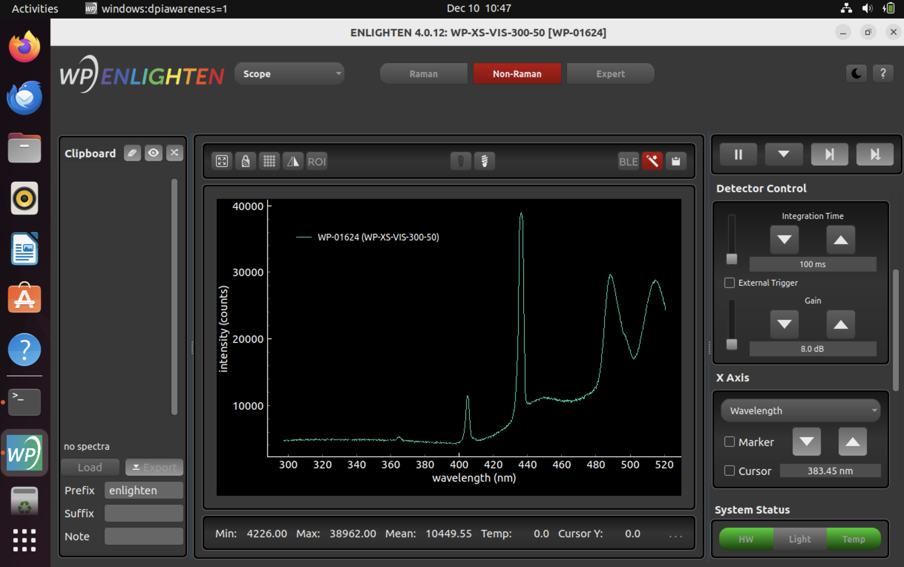

# Ubuntu Linux Installation Instructions

These are the latest steps for installing ENLIGHTEN on Ubuntu. If you are interested in running on a Raspberry Pi, please see [Raspberry Pi Build Instructions](https://github.com/WasatchPhotonics/ENLIGHTEN/blob/main/docs/BUILD_RPI.md).

The following process was tested from fresh Ubuntu VMs (18 LTS and 22.04 LTS tested) running under Parallels 20.1.2 on MacOS 15.1.1.

1. Open a terminal. (Ctrl+Alt+T)

2. Download the install script.

```bash
$ wget wasatchphotonics.com/binaries/apps/enlighten/enlighten_ubuntu_launcher.sh
```

3. Mark it for execution

```bash
$ chmod +x enlighten_ubuntu_launcher.sh
```

4. Run it

```bash
$ ./enlighten_ubuntu_launcher.sh
```

5. Follow on-screen prompts. You may be prompted to enter your password to enable "sudo" privileges.

A video showing the basic process is posted here:

- https://www.youtube.com/watch?v=RKpM3YETon4


